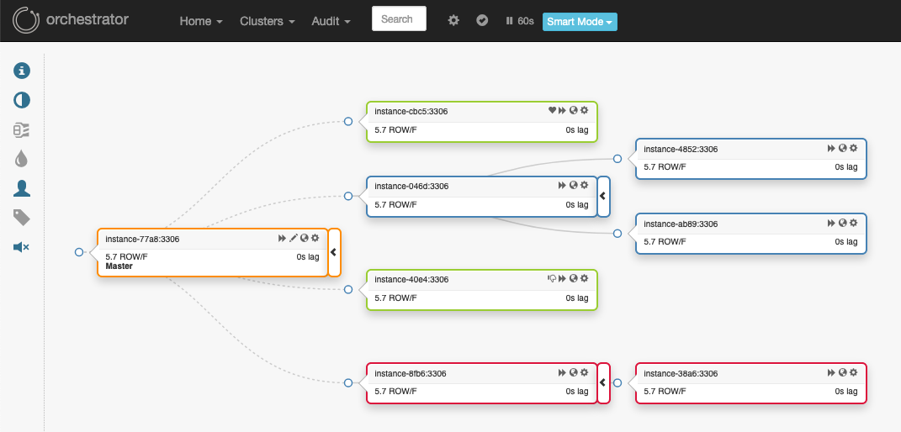

# ORCHESTRATOR
# français
Objectifs
Dans ce projet, vous déploierez une architecture de microservices sur Kubernetes et vous vous familiariserez avec les technologies et concepts clés tels que l'architecture, les déploiements, les services, les entrées et les passerelles API de Kubernetes. De plus, ce projet vous permettra de mettre en pratique vos compétences DevOps, telles que la conteneurisation, l'intégration et le déploiement continus (CI/CD) et l'infrastructure en tant que code ( IaC ) à l'aide des manifestes Kubernetes. À l'issue de ce projet, vous maîtriserez parfaitement l'architecture des microservices et les outils et techniques utilisés pour déployer et gérer ces systèmes avec Kubernetes.

Conseils
Passez du temps sur la théorie avant de vous précipiter dans la pratique.
Lisez la documentation officielle.
Vous devez comprendre les composants du K8.
Tout manque de compréhension des concepts de ce projet peut affecter la difficulté des projets futurs, prenez votre temps pour comprendre tous les concepts.

Soyez curieux et n’arrêtez jamais de chercher !

Architecture
Architecture

Vous devez déployer l'architecture de ces microservices dans un cluster K3s composé des composants suivants :

inventory-database containerest un serveur de base de données PostgreSQL qui contient votre base de données d'inventaire, il doit être accessible via le port 5432.
billing-database containerest un serveur de base de données PostgreSQL qui contient votre base de données de facturation, il doit être accessible via le port 5432.
inventory-app containerest un serveur qui contient votre code d'application d'inventaire en cours d'exécution et connecté à la base de données d'inventaire et accessible via le port 8080.
billing-app containerest un serveur qui contient votre code d'application de facturation en cours d'exécution et connecté à la base de données de facturation et consommant les messages de la file d'attente RabbitMQ, et il est accessible via le port 8080.
RabbitMQ containerest un serveur RabbitMQ qui contient la file d'attente.
api-gateway-app containerest un serveur qui contient votre code de passerelle API exécutant et transmettant les requêtes aux autres services, et il est accessible via le port 3000.
Vous pouvez utiliser les Dockerfiles fournis ici

Le cluster
En utilisant K3s dans Vagrant, vous devez créer deux machines virtuelles :

Master: le maître du cluster K3s.

Agent:un agent du cluster K3s.

Vous devez l'installer kubectlsur votre machine pour gérer votre cluster.

Les nœuds doivent être connectés et disponibles !

$> kubectl get nodes -A NAME
STATUS   ROLES    AGE    VERSION
<master-node>   Ready    <none>   XdXh   vX
<agent1-node>   Ready    <none>   XdXh   vX
$>
Vous devez fournir un orchestrator.shscript qui exécute, crée et gère l'infrastructure :

$> ./orchestrator.sh create
cluster created
$> ./orchestrator.sh start
cluster started
$> ./orchestrator.sh stop cluster stopped $>
Docker Hub
Vous devrez pousser les images Docker pour chaque composant vers Docker Hub.

Vous l'utiliserez dans vos manifestes Kubernetes.

Exemple de Docker Hub

Manifestes
Vous devez créer un manifeste YAML qui décrit chaque composant ou ressource de votre déploiement.

Secrets
Vous devez stocker vos mots de passe et vos informations d'identification en tant que secrets K8s.

Il est interdit de mettre vos mots de passe et identifiants dans les manifestes YAML, à l'exception des manifestes secrets !

Instructions de déploiement des applications
Les applications suivantes doivent être déployées en tant que déploiement et doivent être mises à l'échelle horizontalement automatiquement, en fonction de la consommation du processeur.

api-gateway: réplication max : 3 réplication min : 1 déclencheur de pourcentage CPU : 60 %

inventory-app: réplication max : 3 réplication min : 1 déclencheur de pourcentage CPU : 60 %

Le billing-appdoit être déployé en tant que StatefulSet .

bases de données
Vos bases de données doivent être déployées en tant que StatefulSet dans votre cluster K3s et vous devez créer des volumes qui permettent aux conteneurs de se déplacer sur l'infrastructure sans perdre les données.

Documentation
Vous devez pousser un README.mdfichier contenant la documentation complète de votre solution (prérequis, configuration, installation, utilisation, ...).

Prime
Si vous terminez avec succès la partie obligatoire et que vous avez encore du temps libre, vous pouvez mettre en œuvre tout ce qui, selon vous, mérite d'être un bonus, par exemple :

Utilisez ce que Dockerfilevous avez défini dans votre solution pour play-with-containers

Déployer un tableau de bord Kubernetes pour surveiller le cluster

Déployer un tableau de bord pour les journaux des applications

Kubernetes dans le cloud ?!

Relevez le défi !

Soumission et audit
Vous devez soumettre le README.mdfichier et tous les fichiers utilisés pour créer, supprimer et gérer votre infrastructure : Vagrantfile, Dockerfiles, Manifests, ...

.
├── Manifests
│   └── [...]
├── Scripts
│   └── [...]
├── Dockerfiles
│   └── [...]
└── Vagrantfile
Si vous décidez d’utiliser une structure différente pour votre projet, n’oubliez pas que vous devez être en mesure d’expliquer et de justifier votre décision lors de l’audit.

Lors de l'audit, différentes questions vous seront posées sur les concepts et la pratique de ce projet, préparez-vous !

Quelle est la prochaine étape ?
Afin de développer vos connaissances et votre carrière en tant qu'ingénieur DevOps, nous vous recommandons vivement d'en apprendre davantage et de pratiquer davantage sur Kubernetes et même d'obtenir une certification pour Kubernetes.

https://kubernetes.io/training/

# anglais:
Objectives
In this project, You will deploy a microservices' architecture on Kubernetes, you will gain experience with key technologies and concepts such as Kubernetes architecture, deployments, services, ingresses, and API gateways. Additionally, this project will provide you with an opportunity to practice DevOps skills such as containerization, continuous integration, and deployment (CI/CD), and infrastructure as code (IaC) using Kubernetes manifests. By completing this project, you will have a solid understanding of microservices architecture and the tools and techniques used to deploy and manage such systems using Kubernetes.

Tips
Spend time on the theory before rushing into the practice.
Read the official documentation.
You must understand the K8s components.
Any lack of understanding of the concepts of this project may affect the difficulty of future projects, take your time to understand all concepts.

Be curious and never stop searching!

Architecture
Architecture

You have to deploy this microservices' architecture in a K3s cluster consisting of the following components:

inventory-database container is a PostgreSQL database server that contains your inventory database, it must be accessible via port 5432.
billing-database container is a PostgreSQL database server that contains your billing database, it must be accessible via port 5432.
inventory-app container is a server that contains your inventory-app code running and connected to the inventory database and accessible via port 8080.
billing-app container is a server that contains your billing-app code running and connected to the billing database and consuming the messages from the RabbitMQ queue, and it can be accessed via port 8080.
RabbitMQ container is a RabbitMQ server that contains the queue.
api-gateway-app container is a server that contains your API gateway code running and forwarding the requests to the other services, and it's accessible via port 3000.
You can use the Dockerfiles provided here

The cluster
By using K3s in Vagrant you must create two virtual machines:

Master: the master in the K3s cluster.

Agent: an agent in the K3s cluster.

You must install kubectl on your machine to manage your cluster.

The nodes must be connected and available!

$> kubectl get nodes -A NAME
STATUS   ROLES    AGE    VERSION
<master-node>   Ready    <none>   XdXh   vX
<agent1-node>   Ready    <none>   XdXh   vX
$>
You must provide a orchestrator.sh script that run and create and manage the infrastructure:

$> ./orchestrator.sh create
cluster created
$> ./orchestrator.sh start
cluster started
$> ./orchestrator.sh stop cluster stopped $>
Docker Hub
You will need to push the Docker images for each component to Docker Hub.

You will use it in your Kubernetes manifests.

Docker Hub example

Manifests
You should create a YAML Manifest that describes each component or resource of your deployment.

Secrets
You must store your passwords and credentials as a K8s secrets.

It's forbidden to put your passwords and credentials in the YAML manifests, except the secret manifests!

Applications deployment instructions
The following applications must be deployed as a deployment, and they must be scaled horizontally automatically, depending on CPU consumption.

api-gateway: max replication: 3 min replication: 1 CPU percent trigger: 60%

inventory-app: max replication: 3 min replication: 1 CPU percent trigger: 60%

The billing-app must be deployed as StatefulSet.

Databases
Your databases must be deployed as StatefulSet in your K3s cluster, and you must create volumes that enable containers to move across infrastructure without losing the data.

Documentation
You must push a README.md file containing full documentation of your solution (prerequisites, configuration, setup, usage, ...).

Bonus
If you complete the mandatory part successfully, and you still have free time, you can implement anything that you feel deserves to be a bonus, for example:

Use the Dockerfile you have defined in your solution for play-with-containers

Deploy a Kubernetes Dashboard to monitor the cluster

Deploy a dashboard for applications logs

Kubernetes in cloud ?!

Challenge yourself!

Submission and audit
You must submit the README.md file and all files used to create and delete and manage your infrastructure: Vagrantfile, Dockerfiles, Manifests, ...

.
├── Manifests
│   └── [...]
├── Scripts
│   └── [...]
├── Dockerfiles
│   └── [...]
└── Vagrantfile
If you decide to use a different structure for your project remember you should be able to explain and justify your decision during the audit.

In the audit you will be asked different questions about the concepts and the practice of this project, prepare yourself!

What's next?
In order to develop your knowledge and career as a DevOps engineer, we highly recommend you to learn and practice more about Kubernetes and even get a certification for Kubernetes.

https://kubernetes.io/training/

## Dépôt archivé

> [!IMPORTANT]
> Si vous utilisez Orchestrator pour MySQL et que vous souhaitez collaborer avec d'autres utilisateurs pour maintenir la base de code, veuillez forker https://github.com/percona/orchestrator et y envoyer des demandes de téléchargement.

---

# orchestrator [[Documentation]](https://github.com/openark/orchestrator/tree/master/docs)

 

`orchestrator` est un outil de gestion de la haute disponibilité et de la réplication de MySQL, fonctionnant comme un service et fournissant un accès en ligne de commande, une API HTTP et une interface Web. `orchestrator` supporte :

#### Découverte

`orchestrator` explore activement vos topologies et les cartographie. Il lit les informations MySQL de base telles que l'état et la configuration de la réplication.

Il vous fournit une visualisation claire de vos topologies, y compris les problèmes de réplication, même en cas d'échec.

#### Refactorisation

`orchestrator` comprend les règles de réplication. Il connaît les fichiers binlog file:position, GTID, Pseudo GTID, les serveurs Binlog.

Le remaniement des topologies de réplication peut se faire par simple glisser-déposer d'une réplique sous un autre maître. Le déplacement des répliques est sans danger : `orchestrator` rejettera une tentative de refactorisation illégale.

Un contrôle fin est possible grâce à diverses options de ligne de commande.

#### Récupération

`orchestrator` utilise une approche holistique pour détecter les défaillances des maîtres et des maîtres intermédiaires. Sur la base des informations obtenues à partir de la topologie elle-même, il reconnaît une variété de scénarios de défaillance.

Configurable, il peut choisir d'effectuer une récupération automatisée (ou permettre à l'utilisateur de choisir le type de récupération manuelle). La récupération intermédiaire du maître est réalisée en interne par `orchestrator`. Le basculement du maître est pris en charge par des crochets avant/après la défaillance.

Le processus de récupération utilise la compréhension de la topologie par _orchestrator_ et sa capacité à effectuer un remaniement. Il est basé sur l'_état_ par opposition à la _configuration_ : `orchestrator` choisit la meilleure méthode de récupération en enquêtant/évaluant la topologie au moment de la récupération elle-même.
moment de la récupération elle-même.

#### L'interface

`orchestrator` supporte :

- Interface en ligne de commande (aimez vos messages de débogage, prenez le contrôle des scripts automatisés)
- API Web (accès HTTP GET)
- L'interface web, une interface _slick_.

#### Avantages supplémentaires

- Grande disponibilité
- Prises de contrôle contrôlées
- Basculements manuels
- Audit des basculements
- Opérations vérifiées
- Pseudo-GTID
- Connaissance du centre de données/de l'emplacement physique
- Association MySQL-Pool
- Méthodes de sécurité/authentification HTTP
- Il existe également un forum Google groups [orchestrator-mysql](https://groups.google.com/forum/#!forum/orchestrator-mysql) pour discuter des sujets liés à orchestrator.
- En savoir plus...

Lire la [documentation Orchestrator](https://github.com/openark/orchestrator/tree/master/docs)

Auteur : [Shlomi Noach](https://github.com/shlomi-noach) :

- 2020- comme https://github.com/openark/orchestrator
- 2016-2020 sur [GitHub](http://github.com) comme https://github.com/github/orchestrator
- 2015 chez [Booking.com](http://booking.com) comme https://github.com/outbrain/orchestrator
- 2014 chez [Outbrain](http://outbrain.com) comme https://github.com/outbrain/orchestrator

#### Projets connexes

- Module Orchestrator Puppet : https://github.com/github/puppet-orchestrator-for-mysql
- Orchestrator Chef Cookbook (1) : https://github.com/silviabotros/chef-orchestrator
- Orchestrator Chef Cookbook (2) : https://supermarket.chef.io/cookbooks/orchestrator
- Contrôle Nagios / Icinga basé sur l'API Orchestrator : https://github.com/mcrauwel/go-check-orchestrator
- Wrapper Python léger pour l'API de l'Orchestrator : https://github.com/stirlab/python-mysql-orchestrator

#### Développeurs

Commencez à développer Orchestrator en [lisant la documentation destinée aux développeurs] (/docs/developers.md). Merci de votre intérêt !

#### Licence

`orchestrator` est libre et open source sous la [licence Apache 2.0](LICENSE).

## Repository archived

> [!IMPORTANT]
> **This repository has been archived.** If you are using Orchestrator for MySQL and want to collaborate with other users in maintaining the code base, please fork https://github.com/percona/orchestrator and send pull requests there.

---

# orchestrator [[Documentation]](https://github.com/openark/orchestrator/tree/master/docs)

 

`orchestrator` is a MySQL high availability and replication management tool, runs as a service and provides command line access, HTTP API and Web interface. `orchestrator` supports:

#### Discovery

`orchestrator` actively crawls through your topologies and maps them. It reads basic MySQL info such as replication status and configuration.

It provides you with slick visualization of your topologies, including replication problems, even in the face of failures.

#### Refactoring

`orchestrator` understands replication rules. It knows about binlog file:position, GTID, Pseudo GTID, Binlog Servers.

Refactoring replication topologies can be a matter of drag & drop a replica under another master. Moving replicas around is safe: `orchestrator` will reject an illegal refactoring attempt.

Fine-grained control is achieved by various command line options.

#### Recovery

`orchestrator` uses a holistic approach to detect master and intermediate master failures. Based on information gained from the topology itself, it recognizes a variety of failure scenarios.

Configurable, it may choose to perform automated recovery (or allow the user to choose type of manual recovery). Intermediate master recovery achieved internally to `orchestrator`. Master failover supported by pre/post failure hooks.

Recovery process utilizes _orchestrator's_ understanding of the topology and of its ability to perform refactoring. It is based on _state_ as opposed to _configuration_: `orchestrator` picks the best recovery method by investigating/evaluating the topology at the time of
recovery itself.

#### The interface

`orchestrator` supports:

- Command line interface (love your debug messages, take control of automated scripting)
- Web API (HTTP GET access)
- Web interface, a _slick_ one.

#### Additional perks

- Highly available
- Controlled master takeovers
- Manual failovers
- Failover auditing
- Audited operations
- Pseudo-GTID
- Datacenter/physical location awareness
- MySQL-Pool association
- HTTP security/authentication methods
- There is also an [orchestrator-mysql](https://groups.google.com/forum/#!forum/orchestrator-mysql) Google groups forum to discuss topics related to orchestrator
- More...

Read the [Orchestrator documentation](https://github.com/openark/orchestrator/tree/master/docs)

Authored by [Shlomi Noach](https://github.com/shlomi-noach):

- 2020- as https://github.com/openark/orchestrator
- 2016-2020 at [GitHub](http://github.com) as https://github.com/github/orchestrator
- 2015 at [Booking.com](http://booking.com) as https://github.com/outbrain/orchestrator
- 2014 at [Outbrain](http://outbrain.com) as https://github.com/outbrain/orchestrator

#### Related projects

- Orchestrator Puppet module: https://github.com/github/puppet-orchestrator-for-mysql
- Orchestrator Chef Cookbook (1): https://github.com/silviabotros/chef-orchestrator
- Orchestrator Chef Cookbook (2): https://supermarket.chef.io/cookbooks/orchestrator
- Nagios / Icinga check based on Orchestrator API: https://github.com/mcrauwel/go-check-orchestrator
- Light Python wrapper for Orchestrator API: https://github.com/stirlab/python-mysql-orchestrator

#### Developers

Get started developing Orchestrator by [reading the developer docs](/docs/developers.md). Thanks for your interest!

#### License

`orchestrator` is free and open sourced under the [Apache 2.0 license](LICENSE).

